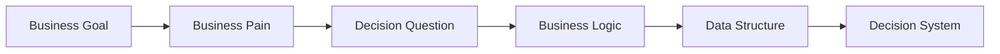
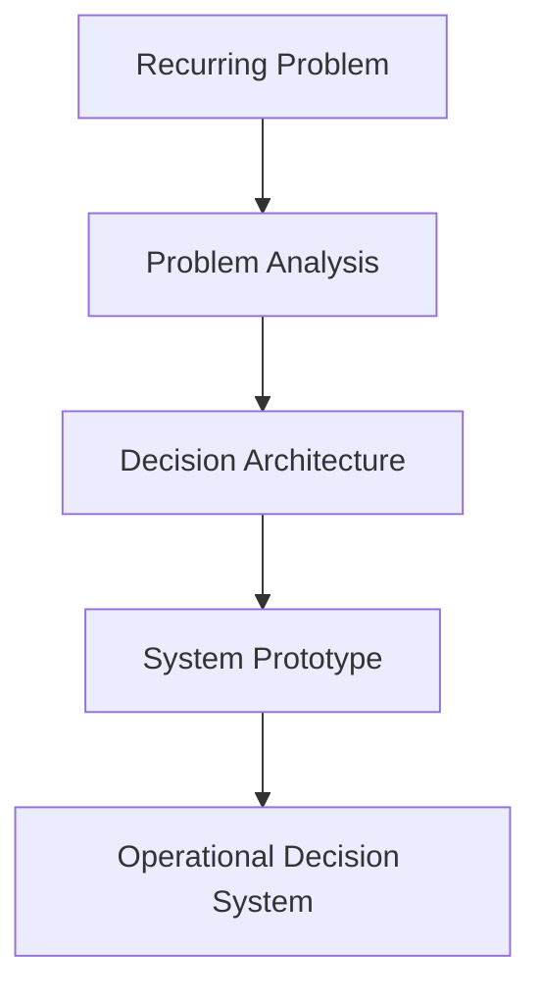

---

# Business Analysis → Decision Architecture

> I design lightweight decision-support systems that turn recurring business problems into repeatable operational decisions.

Most business software starts with features.

My projects start with recurring business problems.

Instead of asking:

> *"What software should we build?" or "Which is better for me?"*

I usually ask:

> *"What decision is difficult today?"*
> *"What information is missing?"*
> *"What process keeps breaking?"*

Then I design the simplest decision system that resolves that problem.

---

Most small businesses don't need another software platform.

They need:

- Better visibility
- Clearer processes
- Consistent decision-making
- Practical ways to manage recurring operational tasks

I operationalize business analysis methods — turning judgment into structure, and structure into repeatable systems.

---

# Who I Am

I design business decision systems for small businesses, operations teams, and independent professionals.

Rather than building large software systems, I focus on turning proven business analysis methods into decision architectures that people can start using immediately.

Most of my work is built with:

- Excel / Google Sheets
- Structured workflows
- Decision-support frameworks
- Lightweight operational systems

---

# What I Actually Build

I do not build:

- ERP systems
- SaaS platforms
- Enterprise software
- Generic dashboards

I build:

- Decision systems
- Operational frameworks
- Business analysis tools
- Repeatable workflows

The goal is not to create more software.

The goal is to help people make better operational decisions.

---

# Why I Build These Systems

Many operational challenges appear to be software problems.

In reality, they are often:

- Visibility problems
- Process problems
- Planning problems
- Tracking problems
- Decision-making problems

Adding more software rarely fixes those issues by itself.

My goal is to create decision systems that help people:

- Understand what is happening
- Organize information consistently
- Reduce manual coordination
- Make better operational decisions

---

# Why Excel and Google Sheets

Most organizations already have:

- Data
- Spreadsheets
- Business knowledge
- Operational experience

What they often lack is:

- Visibility
- Structure
- Decision logic

Excel and Google Sheets remain the fastest way to transform existing business knowledge into operational decision systems — without introducing new platforms or new adoption costs.

---

# Decision Architecture Framework



---

# How I Think About Business Problems

When evaluating an operational challenge, I typically examine five dimensions:

| Dimension | Question |
|---|---|
| **Visibility** | Can people clearly see what is happening? |
| **Consistency** | Can the process be repeated reliably? |
| **Accountability** | Is ownership clearly defined? |
| **Capacity** | Are resources allocated effectively? |
| **Decision Support** | Can managers make informed decisions using available information? |

---

# How I Work

| Step | Focus |
|---|---|
| **Observe** | Identify recurring friction |
| **Analyze** | Find root causes |
| **Structure** | Create repeatable workflows |
| **Build** | Design practical decision systems |
| **Improve** | Refine through usage |



---

# Business Domains

I typically work on decision problems involving:

💰 Profitability

📦 Inventory

📈 Marketing

⚙️ Operations

📋 Compliance

🏗️ Engineering

🧩 Reporting Architecture

If you already know the business problem you are trying to solve, visit:

→ [Business Decision Toolbox](https://github.com/HyVoid/business-decision-toolbox)

There, tools are organized by:

```text
Business Problem
        ↓
Typical Symptoms
        ↓
Decision Question
        ↓
Available Solutions
```

---

# Why Not Just Ask AI?

AI is excellent at generating ideas.

Operational problems are often harder.

The challenge is usually not generating solutions.

The challenge is:

- Defining the real problem
- Identifying missing information
- Structuring decisions
- Creating repeatable workflows

Many of my systems started from situations where this problem-definition work had already been done — a structured decision architecture, rather than a blank page.

---

# Connect

### GitHub

[View the Business Decision Toolbox](https://github.com/HyVoid/business-decision-toolbox)

### LinkedIn

[LinkedIn Profile | View My Business Analysis](https://www.linkedin.com/in/alex-yuhong/)

### Email

Have further need for customized decision systems? Tool use support?
GO with 👉 yu_hong_work@163.com

---

# Final Thought

Most business problems do not require more software.

They require better visibility, better structure, and better decisions.

That's what these decision systems are designed to support.
