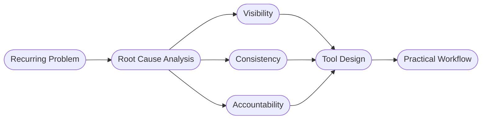
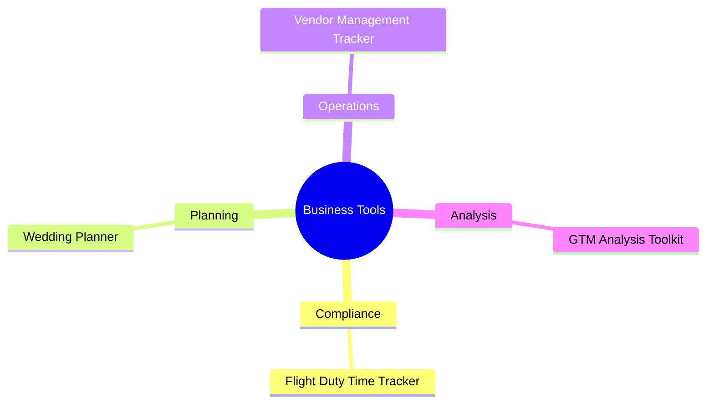

<!-- ============================================================
     HERO BANNER
     手动操作：制作 2560×640 PNG，风格参考 #051C2C 深海军蓝底色
     + 白色居中文字：Business Problems → Practical Tools
     上传至本仓库 /assets/hero.png 后替换下方路径
     ============================================================ -->

<!-- 无图版备用（删除上方图片行时启用）
# Business Problems → Practical Tools
-->

---

Most business software starts with features.

My projects start with recurring business problems.

Instead of asking:

> *"which software is better for me?"*

I ask:

> *"What decision is difficult today?"*  
> *"What information is missing?"*  
> *"What process keeps breaking?"*

Then I build the simplest tool that solves the problem.

---

## How I Work

| Step | Focus |
|------|-------|
| **Observe** | Identify recurring operational friction |
| **Analyze** | Find root causes — visibility, process, or decision gaps |
| **Structure** | Design repeatable workflows before writing a single formula |
| **Build** | Deliver practical tools in familiar formats |
| **Improve** | Refine through real usage |

---

## Product Philosophy

| Principle | What It Means |
|-----------|---------------|
| **Analysis Before Automation** | Understand the problem before adding technology |
| **Simplicity Over Features** | A smaller tool used consistently outperforms a complex tool nobody maintains |
| **Familiar Tools** | People should not need weeks of training to solve operational problems |
| **Repeatable Workflows** | Reduce dependency on individual knowledge; create consistent processes |
| **Business Problem First** | Technology is a delivery mechanism, not the solution |

---

## What I Build

---

## Tool Directory

### Compliance & Audit

| Tool | What It Solves |
|------|----------------|
| [Flight & Duty Time Compliance Tracker](https://github.com/YOUR_USERNAME/REPO_NAME) | Regulatory compliance monitoring for flight operations |
| *More coming* | |

---

### Planning & Scheduling

| Tool | What It Solves |
|------|----------------|
| [Wedding Seating Planner](https://github.com/YOUR_USERNAME/REPO_NAME) | Guest allocation and table coordination |
| *More coming* | |

---

### Operations Management

| Tool | What It Solves |
|------|----------------|
| [Vendor Management Tracker](https://github.com/YOUR_USERNAME/REPO_NAME) | Attendance, assignment, and vendor visibility |
| *More coming* | |

---

### Business Analysis

| Tool | What It Solves |
|------|----------------|
| [GTM Analysis Templates](https://github.com/YOUR_USERNAME/REPO_NAME) | Structured go-to-market decision frameworks |
| *More coming* | |

---

## Who These Tools Are For

Small business owners, operations managers, project coordinators, and independent professionals who need practical systems without the overhead of enterprise software.

Not for teams that need another platform.  
For teams that need better visibility, better structure, and better decisions.

---

## Current Projects

- Wedding Planning Toolkit
- Vendor Management Tracker
- Small Business Operations Templates
- Go-To-Market Analysis Toolkit

---

## Connect

<!-- 手动操作：替换下方三处占位符 -->

| Channel | Link |
|---------|------|
| GitHub | [View All Repositories](https://github.com/YOUR_USERNAME) |
| LinkedIn | [LinkedIn Profile](https://linkedin.com/in/YOUR_PROFILE) |
| Email | your@email.com |

---

<!-- ============================================================
     可选：Social Preview Image
     手动操作：在 GitHub 仓库 Settings → Social Preview
     上传同一张 hero.png，使链接分享时显示品牌图而非默认截图
     ============================================================ -->
