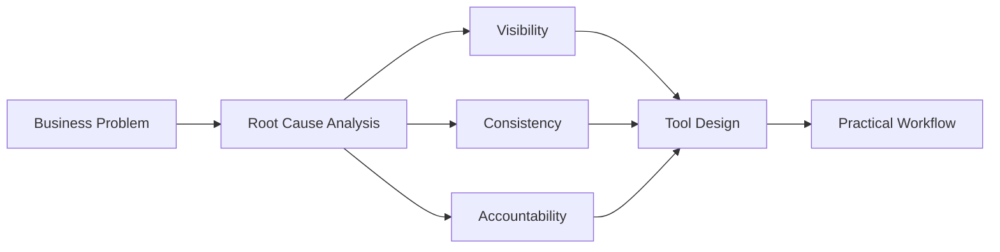
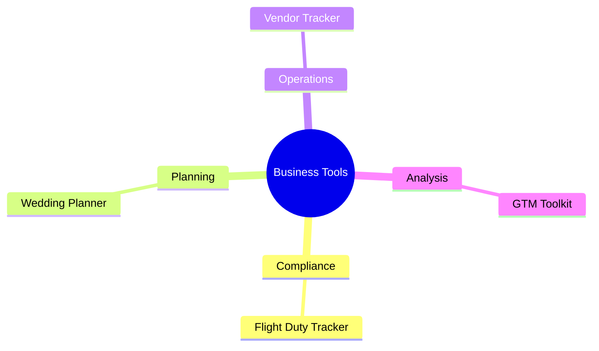
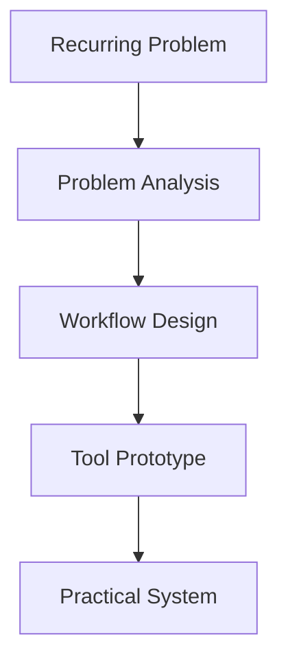

---

# Business Problems → Practical Tools

> I build lightweight operational tools that turn recurring business problems into repeatable workflows.

Most business software starts with features.

My projects start with recurring business problems.

Instead of asking:

> *"What software should we build?" or "Whcih is better for me?"*

I usually ask:

> *"What decision is difficult today?"*
> *"What information is missing?"*
> *"What process keeps breaking?"*

Then I build the simplest tool that helps solve that problem.

---

Most small businesses don't need another software platform.

They need:

- Better visibility
- Clearer processes
- Consistent decision-making
- Practical ways to manage recurring operational tasks

My projects focus on solving operational and management problems using lightweight tools, structured analysis, and familiar workflows.

---

---

# Who I Am

I build business analysis tools for small businesses, operations teams, and independent professionals.

Rather than building large software systems, I focus on turning proven business analysis methods into practical tools that people can start using immediately.

Most of my projects are built with:

- Excel
- Structured workflows
- Decision-support frameworks
- Lightweight operational systems

---

# Why I Build These Tools

Many operational challenges appear to be software problems.

In reality, they are often:

- Visibility problems
- Process problems
- Planning problems
- Tracking problems
- Decision-making problems

Adding more software rarely fixes those issues by itself.

My goal is to create practical tools that help people:

- Understand what is happening
- Organize information consistently
- Reduce manual coordination
- Make better operational decisions

---

# What You'll Find Here

This repository serves as the central directory for all projects.

Projects generally fall into four categories:

| Category | Focus |
|---|---|
| **Compliance & Audit Tracking** | Audit readiness, regulatory tracking, operational control |
| **Planning & Scheduling** | Scheduling, coordination, resource allocation |
| **Operations Management** | Recurring operational activities, visibility systems |
| **Business Analysis** | Structured decision-making frameworks and templates |

---

# Tool Directory

---

## Compliance & Audit Tracking

| Tool | Description |
|---|---|
| Flight & Duty Time Compliance Tracker | Monitor regulatory compliance for flight operations |
| *More Coming Soon* | |

---

## Planning & Scheduling

| Tool | Description |
|---|---|
| Wedding Seating Planner | Guest allocation and table planning |
| *More Coming Soon* | |

---

## Operations Management

| Tool | Description |
|---|---|
| Vendor Management Tracker | Attendance and assignment tracking |
| *More Coming Soon* | |

---

## Business Analysis

| Tool | Description |
|---|---|
| GTM Analysis Templates | Structured go-to-market analysis frameworks |
| *More Coming Soon* | |

---

# My Product Philosophy

Every project follows the same principles:

## 1. Analysis Before Automation

Understand the problem before adding technology.

## 2. Simplicity Over Feature Abundance

A smaller tool used consistently creates more value than a complex tool nobody maintains.

## 3. Familiar Tools Over New Platforms

People should not need weeks of training to solve operational problems.

## 4. Repeatable Workflows Over Manual Expertise

The goal is to reduce dependency on individual knowledge and create consistent processes.

## 5. Business Problems First, Software Second

Technology is a delivery mechanism.

The business problem comes first.

---

# How I Think About Business Problems

When evaluating an operational challenge, I typically examine five dimensions:

| Dimension | Question |
|---|---|
| **Visibility** | Can people clearly see what is happening? |
| **Consistency** | Can the process be repeated reliably? |
| **Accountability** | Is ownership clearly defined? |
| **Capacity** | Are resources allocated effectively? |
| **Decision Support** | Can managers make informed decisions using available information? |

---

# How I Work

| Step | Focus |
|---|---|
| **Observe** | Identify recurring friction |
| **Analyze** | Find root causes |
| **Structure** | Create repeatable workflows |
| **Build** | Design practical tools |
| **Improve** | Refine through usage |

---

# Current Projects

Currently building:

- Wedding Planning Toolkit
- Vendor Management Tracker
- Small Business Operations Templates
- Go-To-Market Analysis Toolkit

---

# Who These Tools Are For

These projects are typically useful for:

- Small business owners
- Operations managers
- Project coordinators
- Compliance teams
- Independent professionals
- Organizations that need practical systems without enterprise software

---

# Connect

### GitHub

[View All Repositories](https://github.com/HyVoid)

### LinkedIn

[LinkedIn Profile](https://www.linkedin.com/in/alex-yuhong/)

### Email

yu_hong_work@163.com

---

# Final Thought

Most business problems do not require more software.

They require better visibility, better structure, and better decisions.

That's what these tools are designed to support.
