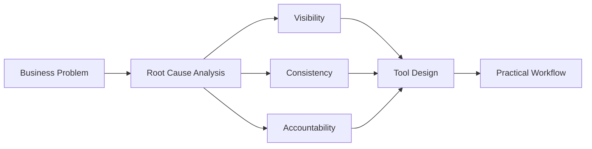
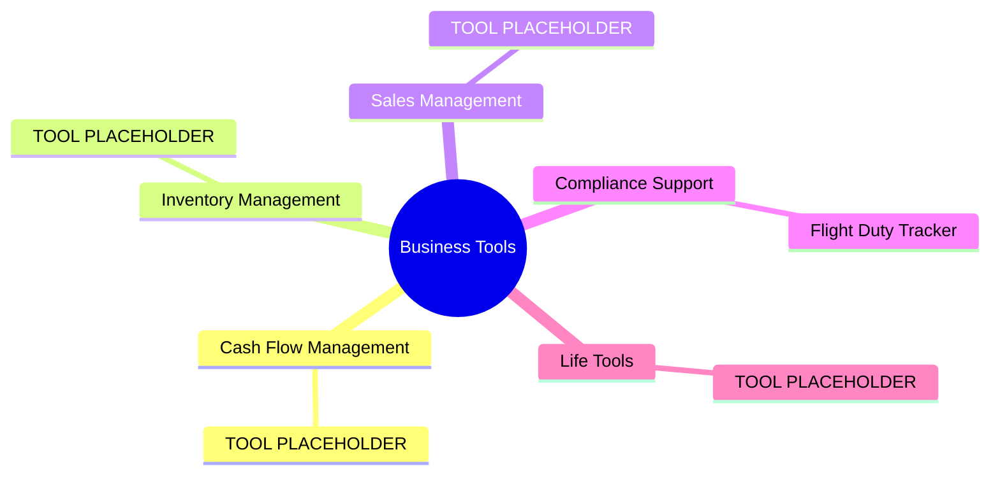
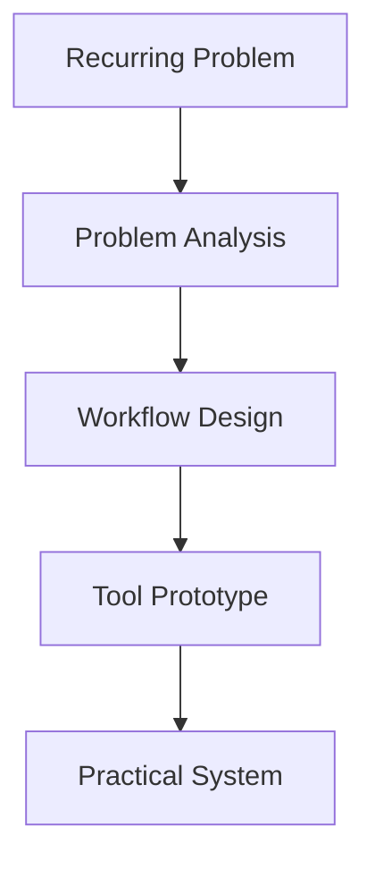

---

# Business Problems → Practical Tools

> I build lightweight operational tools that turn recurring business problems into repeatable workflows.

Most business software starts with features.

My projects start with recurring business problems.

Instead of asking:

> *"What software should we build?" or "Whcih is better for me?"*

I usually ask:

> *"What decision is difficult today?"*
> *"What information is missing?"*
> *"What process keeps breaking?"*

Then I build the simplest tool that helps solve that problem.

---

Most small businesses don't need another software platform.

They need:

- Better visibility
- Clearer processes
- Consistent decision-making
- Practical ways to manage recurring operational tasks

My projects focus on solving operational and management problems using lightweight tools, structured analysis, and familiar workflows.

---

---

# Who I Am

I build business analysis tools for small businesses, operations teams, and independent professionals.

Rather than building large software systems, I focus on turning proven business analysis methods into practical tools that people can start using immediately.

Most of my projects are built with:

- Excel
- Structured workflows
- Decision-support frameworks
- Lightweight operational systems

---

# Why I Build These Tools

Many operational challenges appear to be software problems.

In reality, they are often:

- Visibility problems
- Process problems
- Planning problems
- Tracking problems
- Decision-making problems

Adding more software rarely fixes those issues by itself.

My goal is to create practical tools that help people:

- Understand what is happening
- Organize information consistently
- Reduce manual coordination
- Make better operational decisions

---
# Who These Tools Are For

These projects are typically useful for:

- Small business owners
- Operations managers
- Project coordinators
- Compliance teams
- Independent professionals
- Organizations that need practical systems without enterprise software

---

# What You'll Find Here
---

| Category | Topic Tags |
|---|---|
| **Cash Flow Management** | `budget tracking` `allocation decisions` `actual cash monitoring` `reserve management` `investment timing` |
| **Inventory Management** | `SKU evaluation` `cross-region reconciliation` `inventory health` `margin contribution` `concentration risk` |
| **Sales Management** | `lead qualification` `follow-up timing` `account progression` `pipeline prioritization` `decision under uncertainty` |
| **Compliance Support** | `cross-constraint mapping` `regulatory feasibility` `overlapping rule sets` `compliance diagnostics` |
| **Life Tools** *(Easter Egg)* | `personal planning` `resource allocation` `sequencing` `constraint management` |

---

## Cash Flow Management

Are you making investment decisions based on gut feeling rather than actual cash position? Do you know whether your current reserves support the next allocation — or whether last month's spend has already constrained your options?

This category covers tools that bring structure to cash decisions: budget tracking and allocation logic, actual cash monitoring, and reserve-based decision triggers. The goal is not accounting software. It's making the right call at the right moment with the right information visible.

**Typical Tools**

| Tool | Repository |
|---|---|
| [TOOL NAME PLACEHOLDER] | [REPO LINK PLACEHOLDER] |

---

## Inventory Management

Which SKUs are worth iterating on — and which are quietly eroding margin? When inventory sits across regions, how do you reconcile positions without losing track of what you actually own?

This category addresses the decisions that live inside inventory data: high-value SKU lifecycle evaluation, cross-region stock reconciliation, inventory health diagnostics, margin contribution by item, and concentration risk optimization. Inventory is not a storage problem. It is a capital allocation problem.

**Typical Tools**

| Tool | Repository |
|---|---|
| [TOOL NAME PLACEHOLDER] | [REPO LINK PLACEHOLDER] |

---

## Sales Management

Is this lead worth pursuing? Has enough time passed to follow up — or too much? Which accounts are drifting without a decision?

This category focuses on the judgment layer of sales operations: lead qualification logic, follow-up timing, and customer progression tracking. The tools here are not CRM replacements. They are decision frameworks that help you prioritize action when information is incomplete and time is limited.

**Typical Tools**

| Tool | Repository |
|---|---|
| [TOOL NAME PLACEHOLDER] | [REPO LINK PLACEHOLDER] |

---

## Compliance Support

When regulations overlap, which constraint actually binds? If a decision satisfies Rule A but conflicts with Rule B, is the overall position still viable?

This category handles the structural complexity of compliance: mapping cross-constraint relationships within regulatory frameworks, and running feasibility checks on decisions before they become violations. The tools here do not replace legal counsel. They reduce the analytical cost of navigating rule sets that were not designed to be read together.

**Typical Tools**

| Tool | Repository |
|---|---|
| Flight & Duty Time Compliance Tracker | [REPO LINK PLACEHOLDER] |
| [TOOL NAME PLACEHOLDER] | [REPO LINK PLACEHOLDER] |

---

## Life Tools *(Easter Egg)*

The same optimization logic that applies to operations applies to life. Allocation, sequencing, constraint management, resource limits — these problems do not stop at the office door.

This category applies business analysis methods to personal planning. The problems are smaller. The logic is the same.

**Typical Tools**

| Tool | Repository |
|---|---|
| [TOOL NAME PLACEHOLDER] | [REPO LINK PLACEHOLDER] |

---

# Tool Directory

---

## Cash Flow Management

| Tool | Description |
|---|---|
| [TOOL NAME PLACEHOLDER] | [DESCRIPTION PLACEHOLDER] |
| *More Coming Soon* | |

---

## Inventory Management

| Tool | Description |
|---|---|
| [TOOL NAME PLACEHOLDER] | [DESCRIPTION PLACEHOLDER] |
| *More Coming Soon* | |

---

## Sales Management

| Tool | Description |
|---|---|
| [TOOL NAME PLACEHOLDER] | [DESCRIPTION PLACEHOLDER] |
| *More Coming Soon* | |

---

## Compliance Support

| Tool | Description |
|---|---|
| Flight & Duty Time Compliance Tracker | Monitor regulatory compliance for flight operations under overlapping constraint sets |
| [TOOL NAME PLACEHOLDER] | [DESCRIPTION PLACEHOLDER] |
| *More Coming Soon* | |

---

## Life Tools *(Easter Egg)*

| Tool | Description |
|---|---|
| [TOOL NAME PLACEHOLDER] | [DESCRIPTION PLACEHOLDER] |
| *More Coming Soon* | |

---
# If This Sounds Familiar

You may find these tools useful if:

- You know something is inefficient, but you're not sure how to structure the problem.

- You have discussed the issue with AI, but keep getting generic advice or outputs that don't fit your situation.

- You know a software platform exists, but it feels too expensive, too complex, or too large for the problem you're trying to solve.

- You are currently managing the process with spreadsheets, emails, notes, or manual coordination.

- You need a practical starting point rather than a full consulting engagement.
---
# Why Not Just Ask AI?

AI is excellent at generating ideas.

Operational problems are often harder.

The challenge is usually not generating solutions.

The challenge is:

- Defining the real problem
- Identifying missing information
- Structuring decisions
- Creating repeatable workflows

Many of these tools started from situations where the problem definition work had already been done.

Instead of starting from a blank page, you can start with a framework that has already been structured around a specific operational challenge.

---

# How I Think About Business Problems

When evaluating an operational challenge, I typically examine five dimensions:

| Dimension | Question |
|---|---|
| **Visibility** | Can people clearly see what is happening? |
| **Consistency** | Can the process be repeated reliably? |
| **Accountability** | Is ownership clearly defined? |
| **Capacity** | Are resources allocated effectively? |
| **Decision Support** | Can managers make informed decisions using available information? |

---

# How I Work

| Step | Focus |
|---|---|
| **Observe** | Identify recurring friction |
| **Analyze** | Find root causes |
| **Structure** | Create repeatable workflows |
| **Build** | Design practical tools |
| **Improve** | Refine through usage |

---

# Connect

### GitHub

[View All Tools Repositories](https://github.com/HyVoid)

### LinkedIn

[LinkedIn Profile | View My business analysis](https://www.linkedin.com/in/alex-yuhong/)

### Email

Have further need for customized tools? Tools use support?
GO with 👉 yu_hong_work@163.com

---

# Final Thought

Most business problems do not require more software.

They require better visibility, better structure, and better decisions.

That's what these tools are designed to support.
